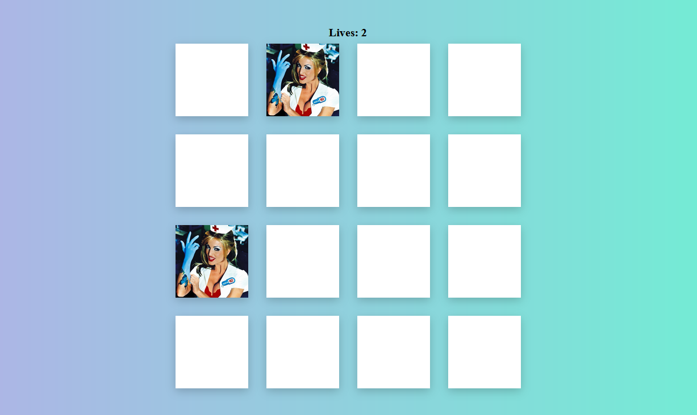

# Meditation-app

Vanilla JavaScript memory game with a card flip animation.

## Table of contents

- [Overview](#overview)
  - [Screenshot](#screenshot)
  - [Links](#links)
- [My process](#my-process)
  - [Built with](#built-with)
  - [What I learned](#what-i-learned)
- [Author](#author)

## Overview

### Screenshot

### Links

- Live Site URL: [Memory Game](https://mdanieladla.github.io/memory-game/)

## My process

### Built with

- Semantic HTML5 markup
- CSS custom properties
- Grid
- Javascript

### What I learned

With this challenge I have improved my layout (HTML5, CSS3) and JS skills.

## Author

- Website - [Daniela Darnea](https://mdanieladla.github.io/portfolio/)
- LinkedIn - [Maria Daniela Darnea](https://www.linkedin.com/in/mdanielad/)
